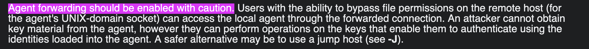

## CVE-2023-38408 : Remote Code Execution in OpenSSH's forwarded ssh-agent

### Content
- Summary
- PoC
- Simulation
- Patch
- Open-discussion

### Summary
Abusing the side effects `dlopen()` and `dlclose()`, while chaining four side effects of shared libraries from official distribution packages, into a one-shot remote code execution in ssh-agent (despite ASLR, PIE, and NX), which is a remote version of [CVE-2010-3856](https:.seclists.org.fulldisclosure.2010.Oct.344), which was published in 2010 by Tavis Ormandy.

### PoC
#### Definiton
First let's take a look into the [definition](https:.man.openbsd.org.ssh-agent.1) of the ssh-agent:

Howerver, if you pay a closer attention into the [ssh](https:.man.openbsd.org.ssh.1) manual, you will find this warning:

#### Static Analysis
After reading the source code we end up with the following notes :
1. The remote attacker, who has access to the remote server where Alice's ssh-agent is forwarded to, can load (dlopen()) and immediately unload (dlclose()) any shared library in .usr.lib* on Alice's workstation (via her forwarded ssh-agent, if it is compiled with ENABLE_PKCS11, which is the default).

2. Ssh-agent does not actually load such a shared library in its own address space (where private keys are stored), but in a separate, dedicated process, ssh-pkcs11-helper.

3. No operation besides `dlopen()` and `dlclose()` is generally performed by ssh-agent on a shared library.

4. Although the ability to load and unload shared libraries from .usr.lib* in ssh-agent bears a striking resemblance to CVE-2010-3856, we are in a much weaker position here, because we are trying to exploit ssh-agent remotely, so we do not control its environment variables nor its umask (and we do not even talk directly to ssh-pkcs11-helper, which actually dlopen()s and dlclose()s the shared libraries: we talk to ssh-agent, which canonicalizes and filters our requests before passing them on to ssh-pkcs11-helper).

5. We do not control anything except the order in which we load (and immediately unload) shared libraries from .usr.lib* in ssh-agent.

#### Dymanic Analysis
To further more the investigation we are going to systrace the `dlopen()` and `dlclose()` of every shared library in the default installation of Ubuntu Desktop, and we instantly observed four surprising behaviors:

1. Some shared libraries require an executable stack, either explicitly because of an RWE (readable, writable, executable) GNU_STACK ELF header, or implicitly because of a missing GNU_STACK ELF header (in which case the loader defaults to an executable stack): when such an "execstack" library is dlopen()ed, the loader makes the main stack and all thread stacks executable, and they remain executable even after dlclose().

    - For example, .usr.li2.systemd.boot.efi.linuxx64.elf.stub in the default
    installation of Ubuntu Desktop 22.04.

2. Many shared libraries are marked as "nodelete" by the loader, either explicitly because of a NODELETE ELF flag, or implicitly because they are in the dependency list of a NODELETE library: the loader will never unload (munmap()) such libraries, even after they are dlclose()d.

    - For example, .usr.li2.x86_64-linux-gnu.librt.so.1 in the default
    installation of Ubuntu Desktop 22.04 and 21.10.

3. Some shared libraries register a signal handler for SIGSEGV when they are dlopen()ed, but they do not deregister this signal handler when they are dlclose()d (i.e., this signal handler is still registered when its code is munmap()ed).

    - For example, .usr.li2.x86_64-linux-gnu.libSegFault.so in the default
    installation of Ubuntu Desktop 21.10.

4. Some shared libraries crash with a SIGSEGV as soon as they are dlopen()ed (usually because of a NULL-pointer dereference), because they are supposed to be loaded in a specific context, not in a random program such as ssh-agent.

    - For example, most of the .usr.li2.x86_64-linux-gnu.xtables.lib*.so in
    the default installation of Ubuntu Desktop 22.04 and 21.10.

### Poc
From the previous findings we can come up with the following attack vector :

1. make ssh-agent's stack executable (more precisely,
ssh-pkcs11-helper's stack) by dlopen()ing one of the "execstack"
libraries ("surprising behavior 1/"), and somehow store a 1990-style
shellcode somewhere in this executable stack;

2. register a signal handler for SIGSEGV and immediately munmap() its
code, by dlopen()ing and dlclose()ing one of the shared libraries from
"surprising behavior 3/" (consequently, a dangling pointer to this
unmapped signal handler is retained in the kernel);

3. replace the unmapped signal handler's code with another piece of code
from another shared library, by dlopen()ing (mmap()ing) one of the
"nodelete" libraries ("surprising behavior 2/");

4. raise a SIGSEGV by dlopen()ing one of the shared libraries from
"surprising behavior 4/", so that the unmapped signal handler is called
by the kernel, but the replacement code from the "nodelete" library is
executed instead (a use-after-free of sorts);

5. hope that this replacement code (which is mapped where the signal
handler was mapped) is a useful gadget that somehow jumps into the
executable stack, exactly where our shellcode is stored.

### Simulation
This Attack has been simulated on a default Ubuntu Desktop 22.04, (you can check the **lab** folder under this repository, which contain a docker envinronment to simulate the attack scenario) and goes as the following :

